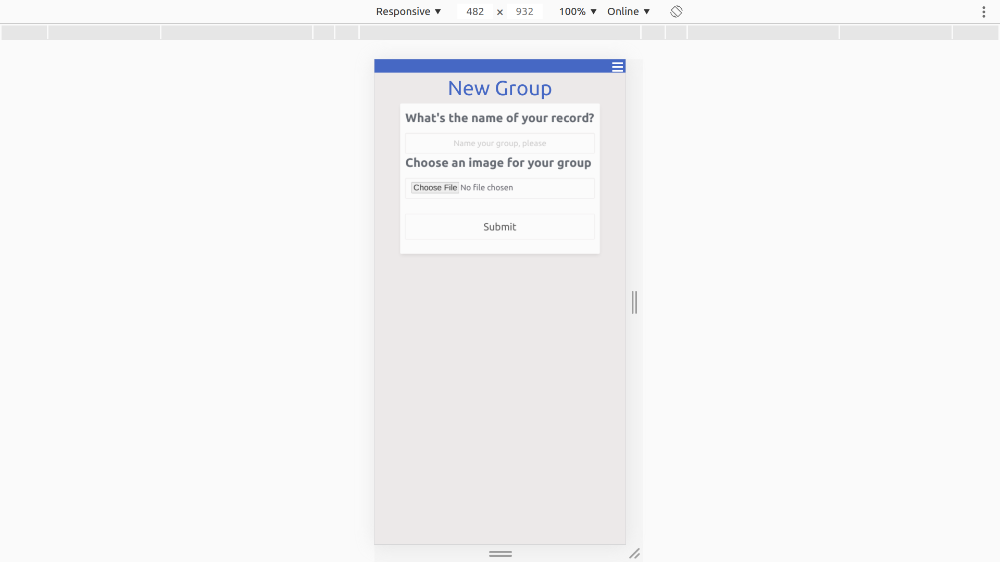
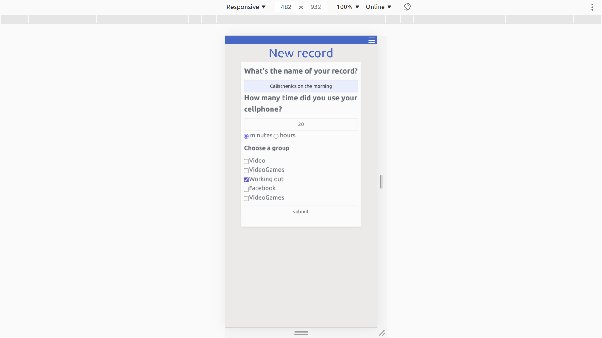
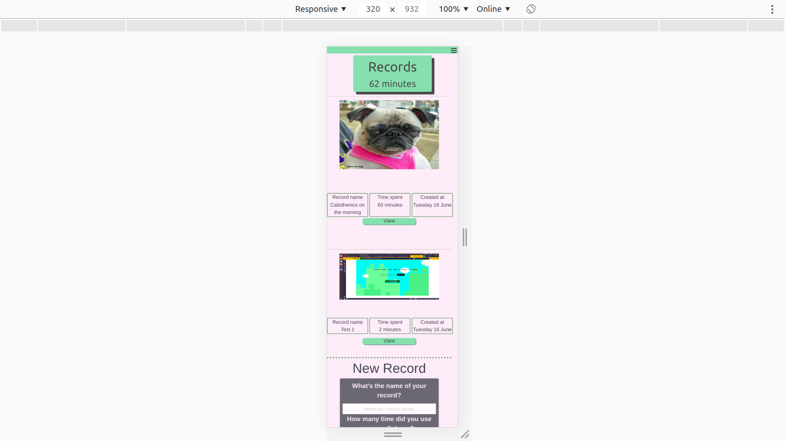

# Ruby on Rails: Phone off

 Phone off is an app for you to manually track the use of your cellphone, so you can see how many time do you spend on different applications.
 You can: 
 * Create groups with images
 * Create records with and without a group relation
 * See all the records associated to a group.

 This is my capstone project for the microverse Ruby on Rails  curriculum

## Screenshots

### Create a group

### Create a new record with that group

### See the results

### Prerequisites

Follow the installation instructions [for Ruby](https://www.theodinproject.com/courses/ruby-programming/lessons/installing-ruby-ruby-programming) and [Rails](https://www.theodinproject.com/courses/ruby-on-rails/lessons/your-first-rails-application-ruby-on-rails) from The Odin Project.

## Live Demo

Check out the Heroku live demo [here](https://warm-wave-61802.herokuapp.com).

## Author

**Alexis Sanchez**
- Github: [@Psiale](https://github.com/Psiale)
- Twitter: [@TFH_](https://twitter.com/TFH_)
- Linkedin: [Alexis Sanchez](https://www.linkedin.com/in/alexis-sanchez-dev/)

## 🤝 Contributing

Contributions, issues and feature requests are welcome!

Feel free to check the [issues page](https://github.com/Psiale/phone-off/issues).

## Show your support

Give a ⭐️ if you like this project!

## Acknowledgments

- Thanks to [Microverse](www.microverse.org) for the opportunity.
- Thanks to [The Odin Project](https://www.theodinproject.com/) for the guidance.

## 📝 License

This project is MIT licensed.
